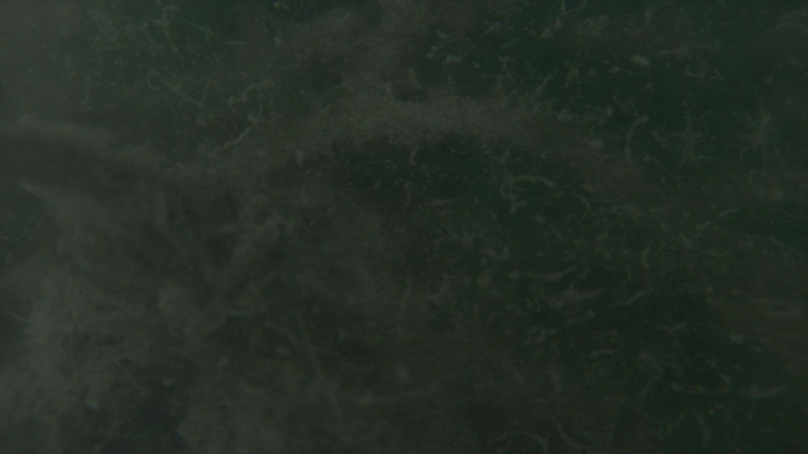
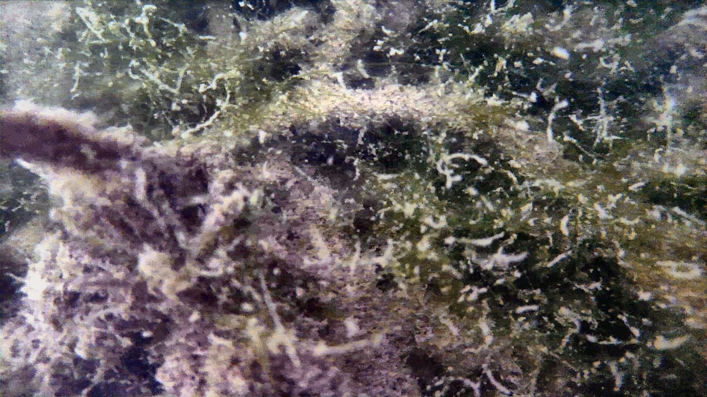
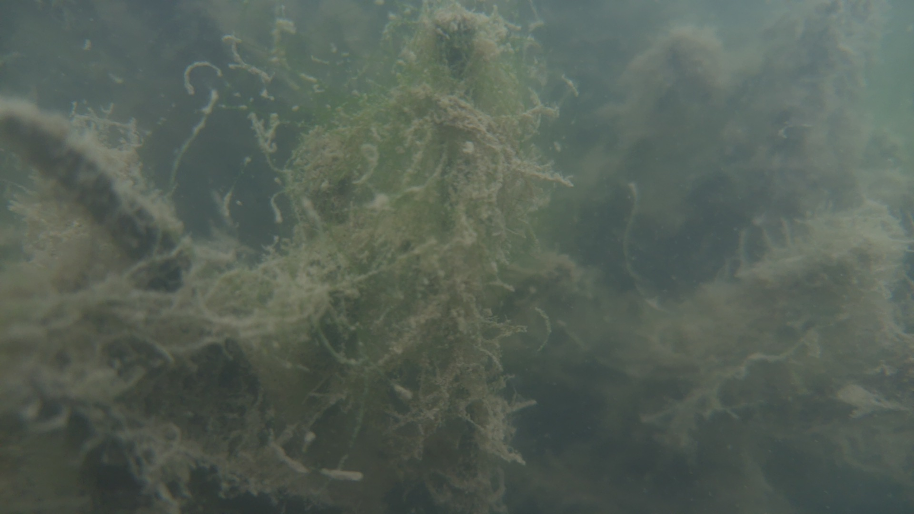
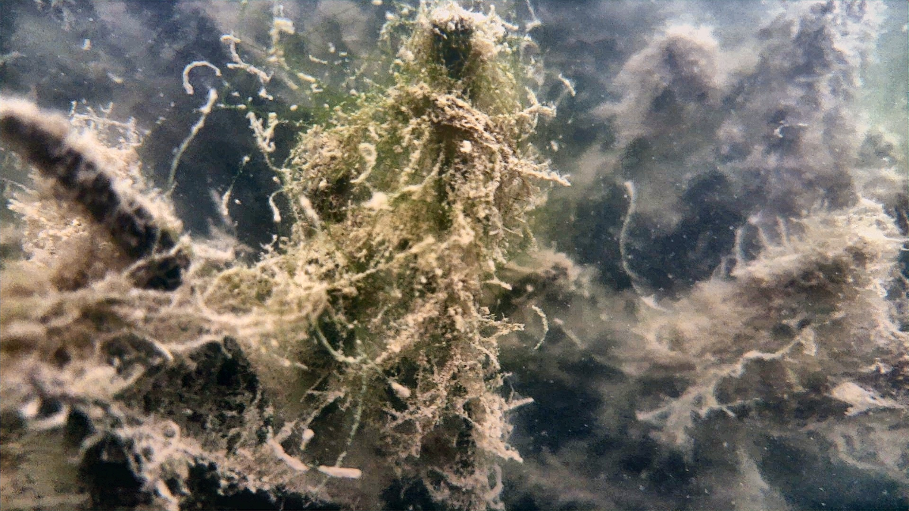
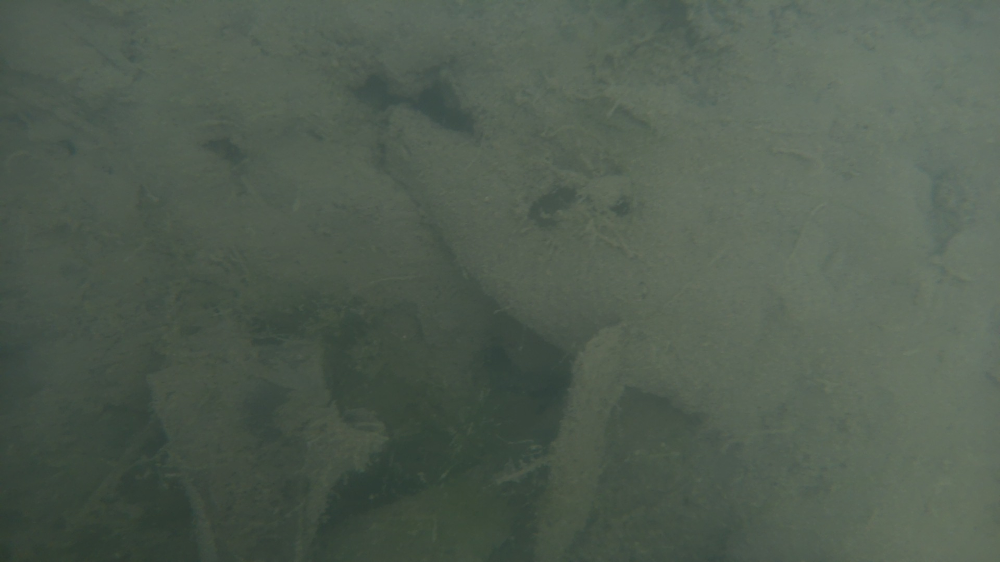
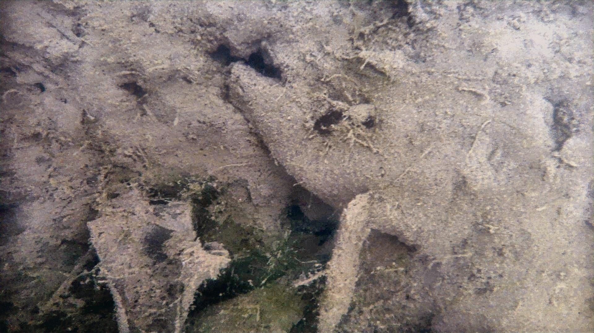

# Underwater Image Enhancement

Underwater image enhancement with WaterNet, sharpening and CLAHE.

```bash
pip install -r requirements.txt
python main.py
```

Place images in `data/input/left/` and `data/input/right/`. Results are saved in the matching folders under `data/output/`.

Code: `underwater_enhancement/` · Weights: `models/weights.pt` · Selected examples: `examples/`.

| Input | Output |
| :---: | :---: |
|  |  |
|  |  |
|  |  |
